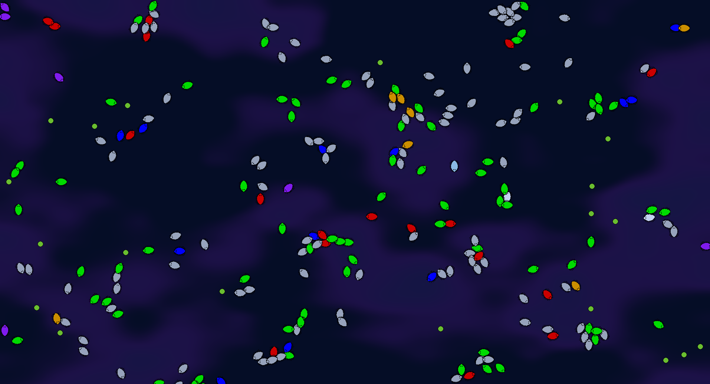

# Bacteria Evolution

A 2D evolution simulator where bacteria with different genes compete for survival.



## Features

- 8 gene types, each with a unique color and ability
- Natural selection: energy, hunger, reproduction, mutation
- Hunters attack other bacteria
- Vampires steal energy from other bacteria
- Armored bacteria take less damage
- Scientists have higher mutation chance
- Peaceful bacteria reproduce faster
- Food spawns automatically over time
- Custom shader background
- Division sound effect

## Controls

- **Add food** — Left mouse click
- **Restart simulation** — R button
- **Quit** - Esc button

## Genes

- **Default (Gray)** — Balanced stats
- **Speed (Blue)** — Moves faster, consumes more energy
- **Hunter (Red)** — Attacks other bacteria
- **Hunger (Green)** — Consumes less energy
- **Peaceful (White)** — Reproduces faster
- **Scientist (Light Blue)** — Higher mutation chance
- **Armor (Orange)** — Takes less damage, moves slower
- **Vampire (Purple)** — Steals energy from other bacteria

## How to Play

1. Watch the simulation run
2. Add food manually by clicking anywhere
4. Restart to start a new simulation

## Modding Guide

You can easily add your own genes to the game!

### How to add a new gene

1. **Create a new gene class** in the `Scripts/Genes/` folder.

```csharp
using Godot;

namespace Evolution.Genes
{
    public class MyGene : Gene
    {
        public override string Name => "My Gene";
        public override Color Color => Colors.Teal;
        
        // Custom stats (adjust these)
        public override float SpeedBonus => 1.2f;
        public override float MetabolismCost => 0.8f;
        public override float AttackDamage => 0f;
        public override float DefenseBonus => 0f;
        public override float VampireSteal => 0f;
        public override float ReproductionCost => 100f;
        public override float MutationChanceBonus => 0f;
    }
}
```

Add your gene to the factory in Scripts/GeneFactory.cs:

Find the CreateRandom() method and add your gene:
```csharp

int roll = _random.Next(0, 100);
// ... existing genes ...
if (roll < 95) return new MyGene();  // 5% chance
```
Build and run — your new gene will appear in the simulation!

### Gene parameters reference

- **SpeedBonus** — Movement speed multiplier (example: `1.5f` = 50% faster)
- **MetabolismCost** — Energy consumption rate (example: `0.5f` = half energy drain)
- **AttackDamage** — Damage dealt to other bacteria (example: `20f` = one-hit kill on weak)
- **DefenseBonus** — Damage reduction, 0 to 1 (example: `0.3f` = 30% less damage)
- **VampireSteal** — Percentage of energy stolen (example: `0.4f` = steal 40%)
- **ReproductionCost** — Energy needed to divide (example: `80f` = easier to reproduce)
- **MutationChanceBonus** — Extra mutation chance (example: `0.05f` = +5% mutation)

Tips for balanced genes:
1. Don't make all stats high — add drawbacks (e.g., high Speed but also high MetabolismCost)
2. Test your gene — run the simulation and watch if it survives or dominates too much
3. Colors with alpha — use new Color(0.5f, 0.2f, 0.8f) for custom RGB

**It's just a tips, you can make a gene whatever you want!**

Example: Laser Gene (instantly kills on hit)
```csharp

public class LaserGene : Gene
{
    public override string Name => "Laser";
    public override Color Color => Colors.Yellow;
    public override float AttackDamage => 999f;  // Kills instantly
    public override float SpeedBonus => 0.8f;    // Slower as drawback
    public override float MetabolismCost => 1.5f; // Hungry
}
```

Pull requests with new genes are welcome! Fork the project, add your gene, and submit a PR.

## Requirements

- Godot 4.6 or later (.NET version)
- .NET 8.0 SDK

## Build from Source

git clone https://github.com/mabex1/bacteria-evolution.git
cd bacteria-evolution

Open the project in Godot and press F5 to run.
License

MIT License
mabex1

Created by https://github.com/mabex1
